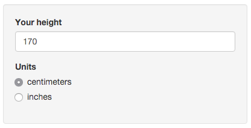
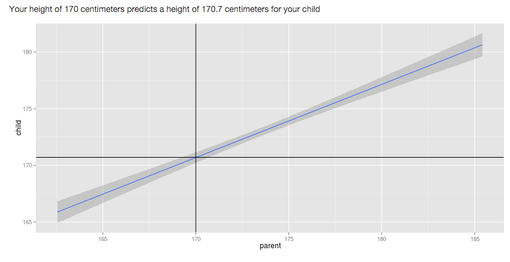

## Introduction

This presentation is an assigment for the *Data Products* class of the *Data Science* coursera specialization.

The purpose of this presentation is to pitch for the Shiny Application developed for the assigment

--- .class #id 

## The application
The Shiny App can be found at:
https://xcidev.shinyapps.io/dataprods

The apllication predicts your child's height according to yours.


---

## How does it work

A Linear Model fit is done over the Galton's parent-child height data:

```{r, warning=FALSE, eval=FALSE}
library(UsingR)
mod <- lm(child~parent, data=galton)
child <- predict(mod, data.frame(parent=parent))
```

---

## How to use it
The user enters its height. It may choose between centimeters or inches



---

## Results
The result is a text with the prediction, plus a plot of the linear fit.



A vertical and horizontal line is positioned at the input and predicted values.


